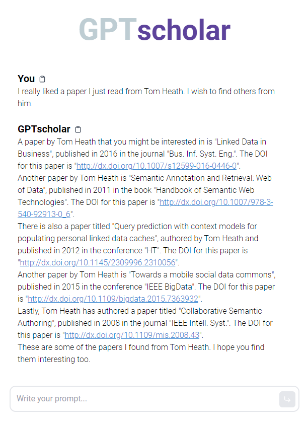

# GPTScholar

This repository contains the code and results for the paper "Enhancing LLMs with Knowledge Graphs for Academic Literature Retrieval", to be published in the [16th International Conference on Knowledge Discovery and Information Retrieval (KDIR 2024)](https://kdir.scitevents.org/Home.aspx?y=2024).



## Installation and Use

In order to run this project, you need to have [docker](https://www.docker.com/) installed on your machine.

If you wish to host a local knowledge graph, you can run `docker-compose up`.
If you wish to remotely access the DBLP knowledge graph, you can run `docker-compose up frontend backend` so that only the frontend and backend are started.

For a local hosting of the knowledge graph, a schema last updated in 2023-10-17 is provided in the 
`datasets` folder, but the data is not due to its size. You can download the data from
[DBLP RDF dump](https://dblp.org/rdf/).

## Environment Variables

In order to run the project, you need to set all of the following environment variables in a
`.env` file (optional variables may be set to empty strings):

- **BACKEND_URL**: The URL of the backend server.
- **FRONTEND_URL**: The URL of the frontend server.
- **KB_SOURCE**: The source of the knowledge graph. Currently, only "dblp" (access DBLP's KG remotely) and "local" (host KG locally) is supported.
- **LLM_SOURCE**: The source of the language model. Currently, only "openai" (use OpenaAI's ChatGPT) and "mock" (emulate an LLM via the backend's stdin) is supported.
- **OPENAI_API_KEY**: (If LLM_SOURCE="openai") The API key for the OpenAI API.
- **FUSEKI_DOMAIN**: (If KG_SOURCE="local") The domain of the Fuseki server.
- **ADMIN_USERNAME**: (If KG_SOURCE="local") The username of the Fuseki server.
- **ADMIN_PASSWORD**: (If KG_SOURCE="local") The password of the Fuseki server.
- **FUSEKI_DATASET_1**: (If KG_SOURCE="local") The name of the dataset in the Fuseki server.
- **FUSEKI_KG**: (If KG_SOURCE="local") The name of the knowledge graph in the Fuseki server.

An example of setting the environment variables is as follows:

```
BACKEND_URL="127.0.0.1:5000"
OPENAI_API_KEY="sk-<OMITTED>"
KB_SOURCE="local"
LLM_SOURCE="openai"
FRONTEND_URL="127.0.0.1:3000"
FUSEKI_DOMAIN="fuseki:3030"
ADMIN_USERNAME="admin"
ADMIN_PASSWORD="admin123"
FUSEKI_DATASET_1="wsdl"
FUSEKI_KG="gpt-scholar"
```

## Experiment

The experiment is conducted in the `backend/` folder. To run the experiment, you need to
run `python3 experiment.py <OPENAI_API_KEY>`. It will generate the results in the `backend/output/`
folder, skipping the ones that are already generated in that folder.

Currently, you can find in the folder `backend/output/` the results of the experiment that were used
in the paper, as well as the file `backend/output/evaluation.json`, which describes the results
of the manual evaluation conducted by the authors.

## Logs

In case you run the backend or the experiment, the logs will be generated in the `backend/logs/` folder.
